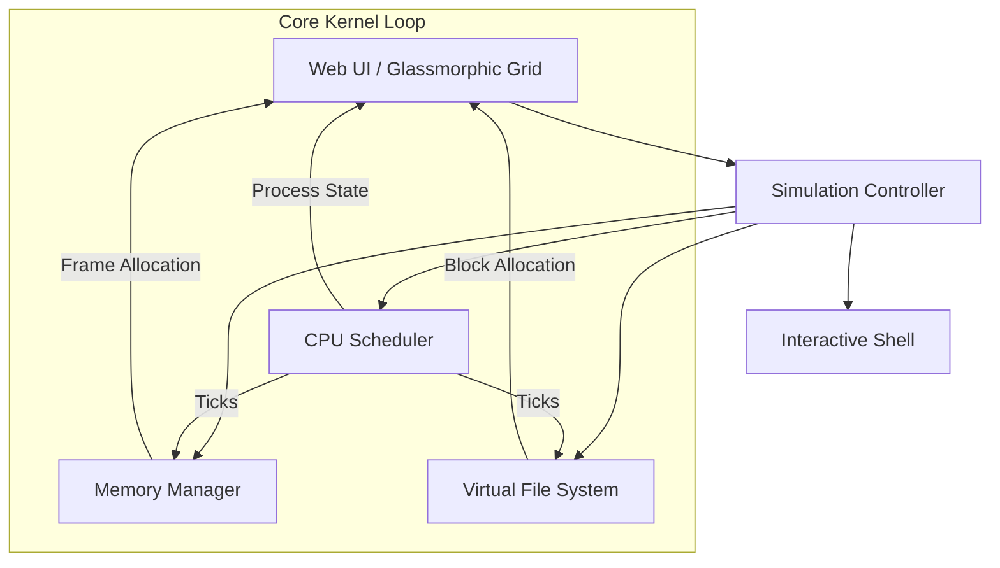

# Project Plan: Interactive Kernel Simulator & Visualizer

A premium, interactive web-based simulator designed to visualize the internal operations of an operating system kernel, specifically focusing on the CPU Scheduler, Memory Manager, File System (VFS), and an interactive shell.

## Architecture

## Subsystem Specifications

### 1. CPU Scheduler
- **States**: `READY`, `RUNNING`, `BLOCKED`, `TERMINATED`.
- **Algorithms**: FCFS, Round Robin (time quantum), Priority.
- **Visuals**: Animated process cards moving between horizontal queues. A timeline chart displaying CPU utilization and Gantt-like execution history.

### 2. Memory Manager
- **Layout**: 16x16 grid representing 256 physical frames (1KB per frame).
- **Algorithms**: First Fit, Best Fit.
- **Visuals**: Frames color-matched to the process owning them. Interactively clicking on a frame displays page allocation details (Page Table entries, Offset, Process ID).
- **Features**: Visual representation of "internal and external fragmentation" and page fault alerts.

### 3. Virtual File System (VFS)
- **Layout**: 128 disk blocks (512 bytes per block) with an INode structure.
- **Visuals**: Grid displaying disk blocks: Boot sector (red), Superblock (gold), INode tables (blue), Data blocks (green/gray). File blocks are linked together visually via lines or color matching.
- **Features**: File fragmentation visualization. When a file is modified/deleted, blocks are allocated or freed.

### 4. Interactive Shell
- **Aesthetic**: Embedded CRT/cyberpunk terminal.
- **Commands**:
  - `help` - Show commands.
  - `fork [ticks] [priority]` - Create a new process (e.g. `fork 10 2`).
  - `kill [pid]` - Terminate process.
  - `alloc [pid] [size_kb]` - Allocate memory for process.
  - `create [file] [blocks]` - Write file to disk.
  - `rm [file]` - Delete file from disk.
  - `ls` - List disk files.
  - `ps` - List processes.
  - `df` - Display disk space.
  - `speed [ms]` - Adjust simulation tick interval (e.g. `speed 200`).
  - `pause` / `resume` - Toggle auto-execution.
  - `clear` - Clear terminal screen.

---

## File Directory Structure

We will create the following files under `/home/csd81/Desktop/kernel-visualizer/`:
1. `index.html` - The structural wrapper, dashboard control deck, and SVG components.
2. `styles.css` - Custom styling: layout grids, neon glassmorphism, responsive scales, and keyframe animations.
3. `app.js` - Single cohesive file for the simulation engine, scheduling algorithms, allocation logic, and rendering updates.
